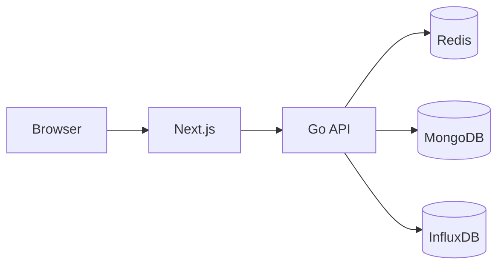
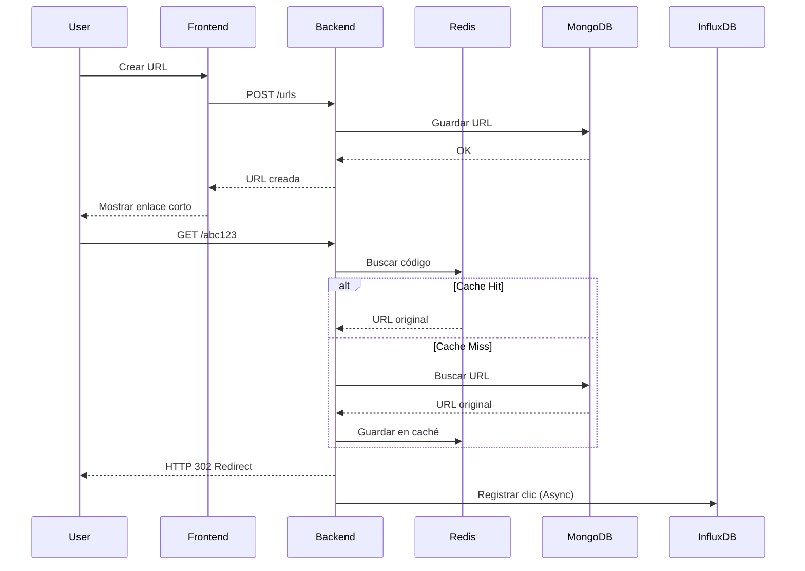

<div align="center">


# Quikko

### Modern URL Shortener Platform

Acortador de URLs moderno desarrollado como una plataforma completa compuesta por un backend de alto rendimiento y un frontend construido con tecnologías modernas.

<p>


</p>

</div>

---

# ✨ ¿Qué es Quikko?

**Quikko** es una plataforma de acortamiento de URLs diseñada para ofrecer redirecciones de baja latencia, métricas en tiempo real y una experiencia moderna para la administración de enlaces.

El proyecto está dividido en dos aplicaciones independientes:

- **Backend:** API REST desarrollada en Go utilizando Clean Architecture.
- **Frontend:** Dashboard desarrollado con Next.js App Router.

Ambos proyectos pueden ejecutarse de forma independiente o como una única plataforma.

---

# ✨ Características

| Plataforma | Funcionalidad |
|------------|---------------|
| 🚀 Backend | API REST de alto rendimiento. |
| 🔗 URL Shortener | Creación y administración de enlaces cortos. |
| 📊 Analytics | Estadísticas en tiempo real mediante InfluxDB. |
| ⚡ WebSocket | Dashboard actualizado en vivo. |
| 🔐 Authentication | JWT Access & Refresh Tokens. |
| 🌎 GeoIP | Detección del país de origen de cada clic. |
| 📱 Frontend | Dashboard completamente responsive. |
| 🌙 Dark Mode | Interfaz preparada para modo oscuro. |
| 📄 OpenAPI | Documentación interactiva. |
| 🐳 Docker | Infraestructura lista para desarrollo. |


# 🚀 Live Demo

| Application | Link |
|-------------|------|
| 🌐 Website | https://quikko.up.railway.app |
| 📊 Dashboard | https://quikko.up.railway.app/dashboard |
| 📖 Swagger UI | https://quikko-api.up.railway.app/docs |
| ❤️ Health Check | https://quikko-api.up.railway.app/health |

> [!TIP]
> The demo environment is automatically deployed from the latest version of the `main` branch.


# 🏗 Arquitectura general



---

# 📦 Monorepo

```
quikko/

│

├── client/
│     Frontend desarrollado con Next.js
│
├── server/
│     Backend desarrollado en Go
│
└── docs/
      Especificaciones del proyecto
```

---

# 🚀 Tecnologías

| Backend | Frontend |
|----------|-----------|
| Go | Next.js 16 |
| Echo | React 19 |
| MongoDB | TypeScript |
| Redis | Tailwind CSS |
| InfluxDB | Zustand |
| JWT | Framer Motion |
| Docker | D3.js |

---

# ⚡ Inicio rápido

## 1. Clonar el repositorio

```bash
git clone https://github.com/tuusuario/quikko.git

cd quikko
```

## 2. Levantar la infraestructura

```bash
cd server

cp .env.example .env

docker compose up -d
```

Esto iniciará:

- MongoDB
- Redis
- InfluxDB

---

## 3. Ejecutar el backend

```bash
cd server

go run cmd/api/main.go
```

El backend estará disponible en:

```
http://localhost:8080
```

Puedes verificar su estado mediante:

```bash
curl http://localhost:8080/health
```

---

## 4. Ejecutar el frontend

En otra terminal:

```bash
cd client

pnpm install

pnpm dev
```

El dashboard estará disponible en:

```
http://localhost:3000
```

---

# 📚 Documentación

Cada proyecto posee su propia documentación.

| Proyecto | README |
|----------|--------|
| Backend | [server/README.md](server/README.md) |
| Frontend | [client/README.md](client/README.md) |

Cada uno incluye instrucciones detalladas de instalación, arquitectura y despliegue.

---

# 📖 Flujo general

```text
Usuario

↓

Frontend (Next.js)

↓

Backend (Go)

↓

Redis

↓

MongoDB

↓

InfluxDB

↓

Dashboard actualizado en tiempo real
```

# 🐳 Docker

Toda la infraestructura necesaria para el desarrollo local se encuentra completamente dockerizada.

Actualmente el proyecto utiliza Docker Compose para levantar automáticamente los servicios de infraestructura requeridos por el backend.

| Servicio | Puerto | Descripción |
|----------|--------|-------------|
| MongoDB | 27017 | Almacenamiento principal de usuarios y URLs. |
| Redis | 6379 | Caché y rate limiting. |
| InfluxDB | 8086 | Base de datos para métricas y analíticas. |

Para iniciar toda la infraestructura:

```bash
cd server

docker compose up -d
```

Para detenerla:

```bash
docker compose down
```

---

# ⚙️ Variables de entorno

Cada aplicación mantiene su propia configuración mediante variables de entorno.

## Backend

```text
server/.env
```

Contiene la configuración de:

- Puerto HTTP
- JWT
- MongoDB
- Redis
- InfluxDB
- Rate Limiting
- GeoIP
- CORS
- Planes de usuario

---

## Frontend

```text
client/.env.local
```

Contiene la configuración de:

- URL de la API
- URL del WebSocket
- Variables públicas de Next.js

---

# 📂 Estructura del repositorio

```text
quikko/

├── client/                # Frontend Next.js
│
├── server/                # Backend Go
│
├── docs/                  # Documentación y especificaciones
│
└── README.md
```

---

# 🔄 Flujo completo de la plataforma



---

# 🛡 Seguridad

El proyecto incorpora diversas medidas para mejorar la seguridad tanto del backend como del frontend.

- JWT Access Token y Refresh Token.
- Passwords protegidas mediante hashing.
- Rate Limiting utilizando Redis.
- Security Headers.
- Body Size Limit.
- Validación estricta de URLs.
- CORS configurable.
- Separación entre rutas públicas y privadas.
- Middleware de autenticación.
- Manejo centralizado de errores.

---

# ⚡ Rendimiento

Quikko está diseñado para minimizar la latencia de las redirecciones.

Algunas decisiones tomadas para lograrlo:

- Redis como primera capa de resolución.
- Escritura asíncrona de analíticas.
- WebSockets para evitar polling.
- Arquitectura desacoplada.
- Caché transparente.
- Conexiones reutilizadas hacia las bases de datos.
- Índices optimizados en MongoDB.

---

# 📚 Documentación

Cada aplicación posee documentación específica.

| Carpeta | Contenido |
|----------|-----------|
| docs | Especificaciones funcionales y arquitectura del proyecto. |
| server | Backend, API REST y documentación técnica. |
| client | Frontend, dashboard y guía de desarrollo. |

Para más información consulta los README correspondientes.

- **Backend:** `server/README.md`
- **Frontend:** `client/README.md`

---

# 🧪 Desarrollo

## Backend

```bash
cd server

go test ./...
```

```bash
go build ./...
```

---

## Frontend

```bash
cd client

pnpm install
```

```bash
pnpm dev
```

```bash
pnpm build
```

---

# 🚀 Despliegue

El proyecto está preparado para desplegarse utilizando contenedores Docker.

Arquitectura recomendada para producción:

```text
Internet

│

▼

Reverse Proxy

│

├──────── Frontend

│

└──────── Backend

            │

      ├──────── MongoDB

      ├──────── Redis

      └──────── InfluxDB
```

Puede desplegarse en plataformas como:

- Railway
- VPS con Docker
- DigitalOcean
- Hetzner
- Contabo

---

# 🤝 Contribución

Las contribuciones son bienvenidas.

Si deseas colaborar con el proyecto:

1. Haz un Fork del repositorio.
2. Crea una nueva rama.
3. Implementa tu cambio.
4. Ejecuta las pruebas.
5. Abre un Pull Request.

---
ß
# 📄 Licencia

Este proyecto se distribuye bajo la licencia **MIT**.

Consulta el archivo **LICENSE** para más información.

