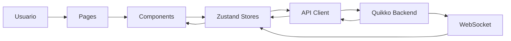
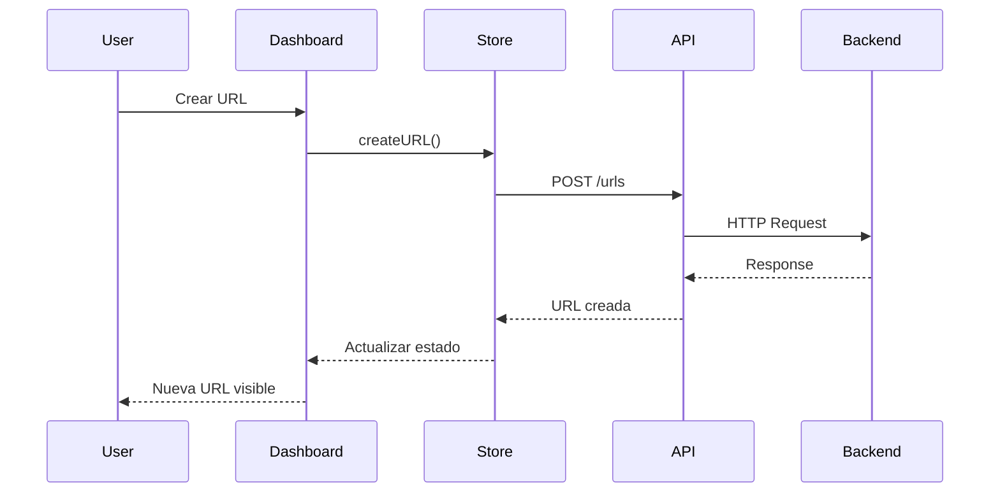

<div align="center">


# Quikko Frontend

### Modern URL Shortener Dashboard built with Next.js

Frontend oficial de **Quikko**, desarrollado con **Next.js**, **React**, **TypeScript** y **Tailwind CSS**, diseñado para ofrecer una experiencia moderna, rápida y completamente responsive para la administración de URLs, analíticas y configuración de cuenta.

<p>


</p>

</div>

---

# ✨ Overview

Quikko Frontend es una aplicación web desarrollada con **Next.js App Router**, diseñada para administrar URLs cortas, visualizar métricas en tiempo real y gestionar la cuenta del usuario mediante una interfaz moderna inspirada en productos SaaS como **Vercel**, **Linear** y **Bitly**.

Toda la comunicación con el backend se realiza mediante una API REST documentada con OpenAPI, mientras que las actualizaciones en tiempo real utilizan WebSockets.

---

# ✨ Características

| Funcionalidad | Descripción |
|--------------|-------------|
| 🚀 Dashboard Moderno | Interfaz limpia y totalmente responsive. |
| 🔗 Gestión de URLs | Crear, editar, activar, desactivar y eliminar enlaces. |
| 📊 Analíticas | Visualización de estadísticas mediante gráficos interactivos. |
| ⚡ Tiempo Real | Actualización instantánea utilizando WebSockets. |
| 🔐 Autenticación | Login, registro y manejo automático de JWT. |
| 🌙 Dark Mode | Interfaz completamente preparada para modo oscuro. |
| 📱 Responsive | Optimizado para escritorio, tablet y móvil. |
| 📈 Dashboard General | Resumen global de todas las URLs del usuario. |
| 📄 Exportación CSV | Descarga de estadísticas directamente desde el dashboard. |
| 🔍 Búsqueda Inteligente | Filtrado y búsqueda de URLs en tiempo real. |
| 🎨 Branding Moderno | Diseño consistente basado en Space Grotesk y Tailwind CSS. |

---

# 🏆 Características técnicas

- Next.js App Router
- React Server Components
- Client Components
- TypeScript estricto
- Tailwind CSS v4
- Zustand para estado global
- Framer Motion para animaciones
- D3.js para gráficos
- WebSockets
- Silent Refresh de JWT
- Middleware para rutas protegidas
- Arquitectura modular
- Componentes reutilizables
- Dark Mode
- SEO optimizado

---

# 📑 Tabla de contenido

- Overview
- Características
- Arquitectura
- Tecnologías
- Estructura del proyecto
- Instalación
- Variables de entorno
- Dashboard
- Estado global
- API Client
- WebSocket
- Autenticación
- Componentes
- Testing
- Despliegue

# 🏗️ Arquitectura

El frontend sigue una arquitectura modular basada en **App Router**, donde la lógica de negocio, la comunicación con la API y la interfaz permanecen completamente desacopladas.



Cada capa posee una única responsabilidad, facilitando el mantenimiento, la reutilización de componentes y el crecimiento del proyecto.

---

# ⚙️ Arquitectura por capas

```text
App Router

│

├── Pages

│

├── Components

│

├── Zustand Stores

│

├── API Client

│

└── Backend
```

La UI nunca realiza llamadas HTTP directamente.

Todo acceso al backend pasa por el cliente HTTP y posteriormente por un Store de Zustand.

---

# 🔄 Flujo de una petición

Cuando un usuario crea una nueva URL ocurre el siguiente flujo:



Este patrón se utiliza en prácticamente todas las operaciones del sistema.

---

# 🗂️ Organización del proyecto

```text
client/

├── app/
│
├── components/
│
├── lib/
│
├── store/
│
├── types/
│
├── hooks/
│
├── public/
│
├── styles/
│
└── middleware.ts
```

---

# 📁 Estructura de carpetas

| Carpeta | Descripción |
|----------|-------------|
| app | Páginas utilizando App Router. |
| components | Componentes reutilizables de toda la aplicación. |
| lib | Cliente HTTP, utilidades y funciones compartidas. |
| store | Estado global utilizando Zustand. |
| hooks | Custom Hooks. |
| public | Logos, iconos e imágenes. |
| styles | Estilos globales. |
| types | Tipos TypeScript compartidos. |

---

# 🎨 Sistema de componentes

La interfaz está construida mediante componentes reutilizables.

```text
Dashboard

│

├── Layout

├── Sidebar

├── Header

├── Cards

├── Charts

├── Tables

├── Forms

├── Buttons

└── Dialogs
```

Todos los componentes mantienen un mismo lenguaje visual basado en Tailwind CSS y Space Grotesk.

---

# 🧠 Estado global

El estado de la aplicación es administrado utilizando **Zustand**, permitiendo compartir información entre páginas sin necesidad de Context API o Redux.

Cada dominio mantiene su propio Store.

| Store | Responsabilidad |
|---------|----------------|
| auth | Autenticación y sesión. |
| urls | Gestión de URLs. |
| analytics | Estadísticas. |
| realtime | WebSockets. |
| notifications | Sistema de notificaciones. |
| ui | Preferencias de la interfaz. |

---

# 🔐 Autenticación

La autenticación utiliza **JWT Access Token** y **Refresh Token**.

El cliente implementa un mecanismo de **Silent Refresh**, permitiendo renovar automáticamente el Access Token sin que el usuario tenga que volver a iniciar sesión.

```text
Login

↓

Access Token

↓

API Request

↓

401 Unauthorized

↓

Refresh Token

↓

Nuevo Access Token

↓

Reintentar petición
```

Este proceso ocurre de forma completamente transparente.

---

# 📡 Comunicación con la API

Toda comunicación HTTP pasa por un único cliente centralizado.

```text
Component

↓

Store

↓

API Client

↓

Backend
```

El cliente HTTP se encarga de:

- Agregar automáticamente el Access Token.
- Renovar tokens expirados.
- Manejar errores comunes.
- Normalizar respuestas.
- Tipar todas las peticiones mediante TypeScript.

---

# ⚡ Actualizaciones en tiempo real

El dashboard mantiene una conexión WebSocket persistente con el backend.

```mermaid
flowchart LR

Backend --> WebSocket

WebSocket --> Realtime Store

Realtime Store --> Dashboard

Realtime Store --> Charts

Realtime Store --> Tables

Realtime Store --> Notifications
```

Cada nuevo clic recibido desde el backend actualiza automáticamente los gráficos y estadísticas sin necesidad de recargar la página.

---

# 🎯 Principios del proyecto

- Arquitectura modular.
- Componentes altamente reutilizables.
- Estado global desacoplado.
- Separación entre UI y lógica de negocio.
- Comunicación centralizada con la API.
- Tipado estricto mediante TypeScript.
- Mobile First.
- Dark Mode por defecto.
- Alto rendimiento.
- Fácil mantenimiento.
