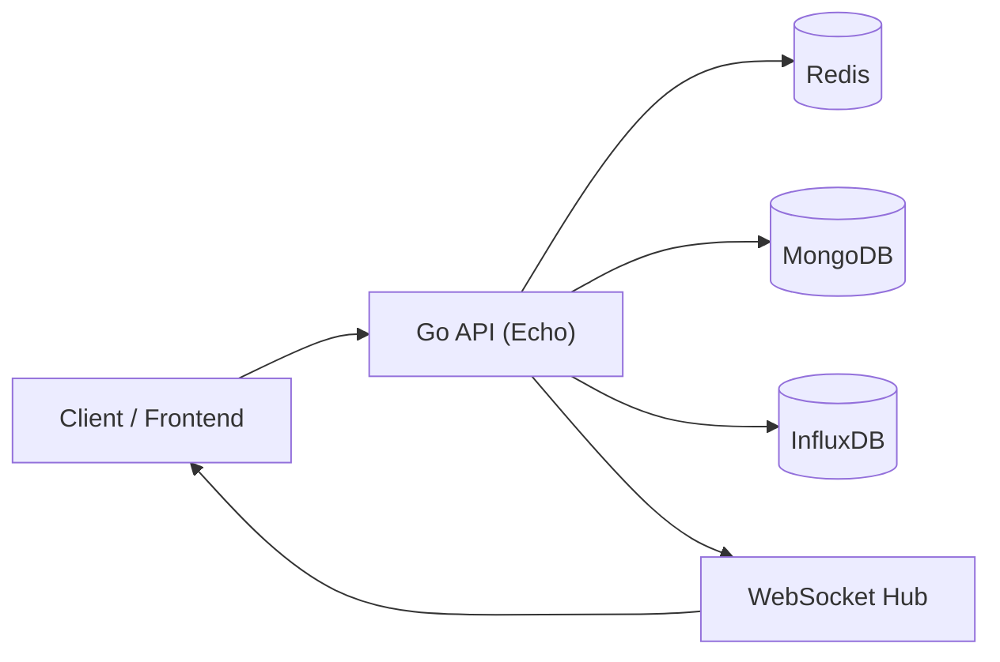
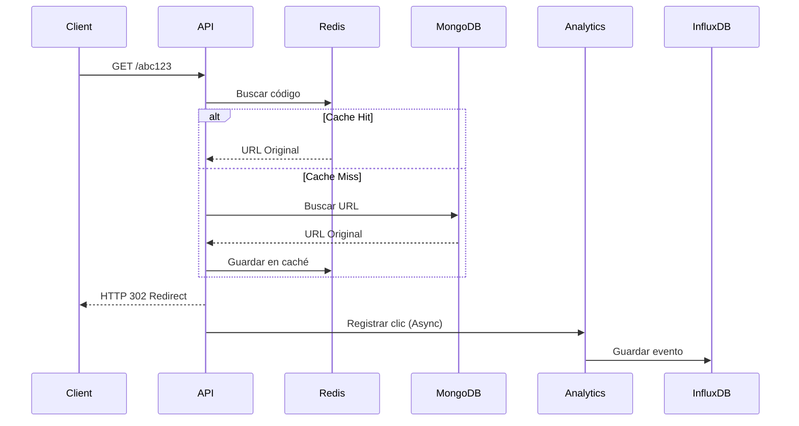
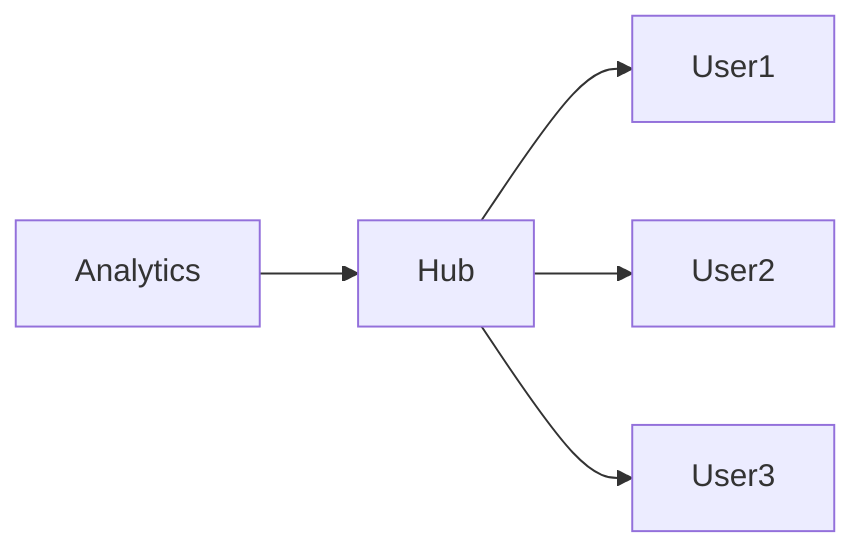

<div align="center">


# Quikko Backend

### High-performance URL Shortener API built with Go

Acortador de URLs moderno diseñado para ofrecer redirecciones de baja latencia, analíticas en tiempo real y una arquitectura escalable basada en **Go**, **MongoDB**, **Redis** e **InfluxDB**.

<p>


</p>

</div>

---

## ✨ Overview

Quikko es un backend desarrollado siguiendo los principios de **Clean Architecture**, enfocado en ofrecer un servicio de acortamiento de URLs rápido, seguro y preparado para escalar.

Cada componente tiene una responsabilidad claramente definida:

- **Redis** actúa como capa principal para resolver redirecciones con mínima latencia.
- **MongoDB** almacena usuarios, URLs y metadatos.
- **InfluxDB** registra millones de eventos de clics de forma eficiente.
- **WebSocket** mantiene los dashboards sincronizados en tiempo real.
- **JWT** protege toda la API privada.
- **OpenAPI** documenta completamente el servicio.

---

# ✨ Características

| Funcionalidad | Descripción |
|--------------|-------------|
| 🚀 High Performance Redirect | Redirección optimizada utilizando Redis como primera capa de lectura. |
| 📊 Real-time Analytics | Registro y consulta de métricas mediante InfluxDB. |
| ⚡ Live Dashboard | Actualización instantánea mediante WebSockets. |
| 🔐 JWT Authentication | Access Token + Refresh Token. |
| 👤 User Management | Registro, autenticación y administración de cuentas. |
| 🔗 URL Management | Crear, editar, activar, desactivar y eliminar URLs. |
| 📈 Analytics Dashboard | Estadísticas por URL y globales. |
| 🌎 Geo Location | Resolución del país de origen de cada clic. |
| 📄 QR Generation | Código QR generado automáticamente para cada URL. |
| 📥 CSV Export | Exportación de métricas. |
| 🛡 Rate Limiting | Protección contra abuso utilizando Redis. |
| 📚 OpenAPI | Documentación interactiva mediante Swagger UI. |
| 🐳 Docker Ready | Infraestructura lista para desarrollo y despliegue. |
| ⚙️ Clean Architecture | Separación estricta entre dominio, aplicación e infraestructura. |

---

# 🏆 Principales características técnicas

- Arquitectura basada en dominios.
- Inyección manual de dependencias.
- Repositorios desacoplados mediante interfaces.
- Manejo centralizado de errores.
- JWT Access & Refresh Tokens.
- Caché transparente utilizando Redis.
- Analíticas desacopladas mediante escritura asíncrona.
- Comunicación en tiempo real mediante WebSockets.
- Configuración mediante variables de entorno.
- Documentación OpenAPI integrada.
- Preparado para despliegues utilizando Docker y Railway.

---

## 📑 Tabla de contenido

- Overview
- Características
- Arquitectura
- Tecnologías
- Estructura del proyecto
- Instalación
- Docker
- Variables de entorno
- Flujo de redirección
- API
- Seguridad
- Analíticas
- GeoIP
- WebSocket
- Testing
- Despliegue
- Roadmap
- Licencia


# 🏗️ Arquitectura

Quikko implementa una arquitectura desacoplada basada en **Clean Architecture**, donde cada dominio mantiene responsabilidades claramente definidas y la infraestructura permanece aislada de la lógica de negocio.



La aplicación utiliza un enfoque **Repository → Service → Handler**, desacoplando completamente la lógica de negocio de la infraestructura.

```
HTTP Request
      │
      ▼
 Handler
      │
      ▼
 Service
      │
      ▼
 Repository
      │
      ▼
 Infrastructure
```

Cada dominio mantiene su propia implementación y únicamente expone interfaces hacia el resto del sistema, evitando dependencias circulares y facilitando las pruebas unitarias.

---

# ⚙️ Arquitectura por dominios

| Dominio | Responsabilidad |
|----------|-----------------|
| Authentication | Registro, autenticación y administración de usuarios. |
| URL Shortener | Creación y administración de URLs cortas. |
| Redirect | Resolución de códigos y redirecciones. |
| Analytics | Registro y consulta de estadísticas. |
| Realtime | Comunicación mediante WebSockets. |
| Platform | Infraestructura compartida (Mongo, Redis, JWT, Middleware, InfluxDB). |
| Config | Gestión centralizada de configuración mediante variables de entorno. |
| Response | Envelope estándar de respuestas HTTP. |

---

# 🔄 Flujo de una redirección

El endpoint público de redirección (`GET /:code`) es el componente más optimizado del sistema.



## ¿Por qué es rápido?

Cuando Redis contiene la URL:

- No se consulta MongoDB.
- No se consulta InfluxDB.
- La respuesta HTTP 302 se devuelve inmediatamente.
- Las analíticas se registran de forma asíncrona.

Esto permite mantener una latencia extremadamente baja incluso bajo cargas elevadas.

---

# 📊 Flujo de analíticas

Cada clic genera un evento que posteriormente alimenta el dashboard en tiempo real.

```text
Click

 │

 ▼

Redirect

 │

 ▼

Analytics Service

 ├────────► InfluxDB
 │
 └────────► WebSocket Hub

                  │
                  ▼

          Dashboard en tiempo real
```

Cada evento almacena información como:

- Fecha y hora.
- URL visitada.
- Usuario propietario.
- País de origen.
- Navegador.
- Sistema operativo.
- Dispositivo.

---

# 📡 Arquitectura en tiempo real

El backend incorpora un Hub de WebSockets que permite mantener sincronizados todos los dashboards conectados.



Cada nuevo clic publicado por Analytics es enviado inmediatamente al Hub, el cual redistribuye el evento únicamente a los clientes autorizados.

No es necesario realizar polling sobre la API para actualizar las métricas.

---

# 🚀 Stack tecnológico

| Categoría | Tecnología |
|-----------|------------|
| Lenguaje | Go 1.26+ |
| Framework HTTP | Echo |
| Base de datos | MongoDB |
| Caché | Redis |
| Base de datos Time Series | InfluxDB |
| Autenticación | JWT |
| Comunicación en tiempo real | WebSocket |
| Documentación | OpenAPI + Swagger UI |
| Contenedores | Docker |
| Arquitectura | Clean Architecture |

---

# 🛠️ Tecnologías utilizadas

## Backend

- Go
- Echo Framework
- Validator
- JWT
- Mongo Driver
- Redis Client
- InfluxDB Client

## Infraestructura

- Docker
- Docker Compose

## Bases de datos

- MongoDB
- Redis
- InfluxDB

## Comunicación

- REST API
- WebSocket

## Documentación

- OpenAPI
- Swagger UI

